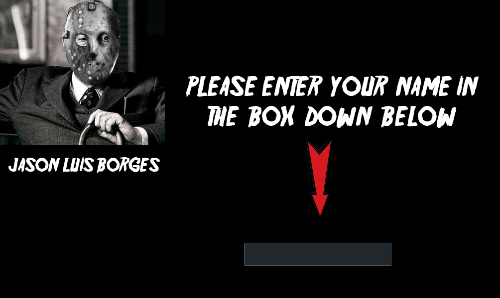
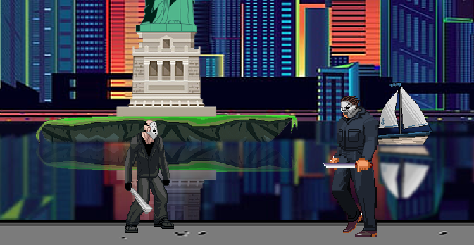

# PYGAME PROJECT: PROGRAMACION I (UTN) "FRIDAY THE 13th"

## Alumn:
-Mariano Nicolas Aquino

## MAIN MENU:

Main menu displays 4 buttons:
-Start Game
-Controls
-About
-Score Ranking

### CONTROLS:
 It shows the controls you gonna be using for the game
 

### ABOUT:
 It just shows some information about the project
 

### SCORE RANKING:
Shows the ranking in descending order. Name followed by it's score

### START GAME:
When pressed it takes you to the input section where you should put your name into a textbox.

## THE GAME:

### FIRST LEVEL (JASON LIVES):
First level begins with Jason Voorhees at the graveyard. He's fighting the police, getting some score by
taking rubies and also getting some extra life when drinking beer.
He has to avoid getting hit by the chopper and some turrets that are shotting at him. There's also lava in this level
and some spinning saw that can do some damage to the character.

At any time, you can stop the game by clicking on the "pause" button at the bottom right corner of the screen. It will completely
freeze the game and you will be able to go back to the main menu or just resume the game.

If jason dies, then this screen will apear:

When completed, jason faces the first boss which is also shooting at him. Once jason kills this boss, he gets abducted
by a UFO unexpectedly.

### SECOND LEVEL (ABDUCTED):
Second level starts with Jason inside of this spaceship that just abducted him. He has to kill some aliens, drink beer,
and also deactivate a force field that can actually kill him. There are also some drones you will have to destroy and some blue
orbs that make some damage.

When completed, jason faces the second boss, which is an alien.

### THIRD LEVEL (JASON TAKES MANHATTAN):
This is the last level. Jason's in manhattan and he has to deal with gangsters, crazy taxi drivers and also drink beer, get diamonds
and sort some platforms. 

At the very end, jason has to fight the third boss, which is actually Michael Myers from Halloween.

## ENDING:
It shows the highest score in the game and also your score.

## MUSIC CREDITS:
-Main Menu: Altar of sacrifice - Slayer
-First level: The dark eternal night - Dream Theater
-First level boss: Culinary Hyperversity - Necrophagist
-Second level: The ancient covenant - The faceless
-Second level boss: An autopsy - The faceless
-Third level: Pale blue dot - Dream Theater
-Third level boss: Fermented offal discharge - Necrophagist
-Ending: Going the distance - Bill Conti